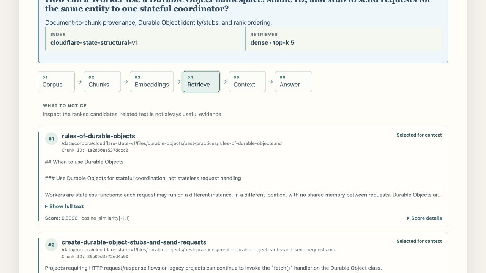

# tiny-rag-lab

[简体中文](README.zh-CN.md) · [Project site](https://jameswei.github.io/tiny-rag-lab/)

> A learning-first, inspectable classic RAG lab with readable Python, a rich
> browser Studio, direct CLI experiments, real-corpus traces, and bilingual
> Learning Guides.

`tiny-rag-lab` makes the path between a question, a document corpus, retrieved
evidence, packed context, and a cited answer visible and inspectable. Readable
Python keeps the RAG mechanics explicit; a rich browser Studio turns their
artifacts into guided replays and hands-on experiments; a direct CLI supports
repeatable inspection. Searchable English and Simplified Chinese Learning
Guides open beside the lab when a concept deserves quieter, deeper reading.

It is a learning tool, not a production RAG platform. The project favors
visible mechanics over framework magic, evaluation before optimization, and
failure analysis before advanced features.



## Learn through real evidence, not a toy demo

The local visual workspace is a first-class learning environment, not a
dashboard around the CLI. It gives learners a complete local path for
understanding classic RAG on real technical documentation.

Instead of a synthetic one-document replay, learners begin with four saved,
provider-free lessons over a pinned 40-document Cloudflare corpus. Every
lesson preserves the real artifacts that connect one RAG stage to the next:
source documents, chunks, query vectors, ranked candidates, selected and
omitted context, prompts, answers, and citations. From that guided baseline,
learners can run their own retrievals, build indexes, bring a small corpus,
compare the inspectable NumPy index with optional Qdrant, and use Live Ask
only when a tested provider is available.

This makes the project useful in two complementary ways: readable source code
and a direct CLI for studying the mechanics, plus an interactive experimental
web application for seeing those mechanics operate on real evidence.

When a stage needs a deeper conceptual explanation, the local Studio also
ships bilingual **Learning Guides**: searchable, long-form reading that opens
beside the experiment without sending the learner to GitHub. The guides support
the two entry points rather than introducing a separate RAG experience.

Here, **classic RAG** means one visible, inspectable path: retrieve evidence
from a corpus, select and pack it into context, then generate a grounded answer
with citations. A tested OpenAI-compatible provider completes that generation
step for Live Ask; it does not change the project into agentic or multi-step
RAG.

## One inspectable core, two learning entry points

The web application and CLI are complementary ways to learn the same
project-owned RAG core—not separate products with separate mechanics. Both work
with the same documents, chunks, embeddings, retrieval results, selected
context, prompts, citations, and traces.

- **Local visual workspace:** the recommended starting point. It guides a
  learner through real-corpus replays, makes intermediate artifacts easy to
  inspect, and supports hands-on retrieval, indexing, failure, and provider
  experiments.
- **CLI:** the direct, compact, and scriptable entrypoint. It is suited to
  repeating a configuration, comparing results, inspecting raw output, and
  following the mechanics command by command.

## What makes this lab different

Many RAG examples stop at a framework call, a chatbot screen, or a single
happy-path answer. `tiny-rag-lab` connects the concepts a learner needs to
reason about:

- **The implementation and experience stay connected.** The CLI and web
  workspace render artifacts from the same project-owned RAG core instead of
  teaching an abstract diagram disconnected from executable code.
- **Real artifacts are the lesson.** Guided replay shows the actual source
  documents, chunks, vectors, ranked candidates, selected and omitted context,
  prompt, answer, citations, and timing behind a result.
- **Guidance leads to experimentation.** A learner can start with a stable,
  provider-free real-corpus replay, then change retrieval, build an index,
  upload a small corpus, or connect a provider for Live Ask.
- **Failure is part of learning.** Evaluation, trace inspection, and curated
  failure scenarios make it possible to ask why a result happened—not only
  whether an answer was returned.

## Start with the local visual lab

The fastest way to learn is to run the bundled local studio:

```bash
cp .env.example .env
docker compose up --build
```

Open http://127.0.0.1:8000 in your browser. The Learning Guides are available
at http://127.0.0.1:8000/docs/ and are also linked from relevant lab stages.
The Studio and guides run locally; no public deployment or account is required.
Live Ask contacts only the provider you configure.

A useful first visit follows this path:

1. **Home → Start guided lesson:** replay one of four saved lessons over a
   pinned 40-document Cloudflare State & Coordination corpus.
2. **Learn:** step through corpus, chunks, embedding vector, retrieved
   candidates, selected context, grounded answer, and citations.
3. **Explore:** ask a catalog or free-form question, compare Dense, BM25, and
   Hybrid retrieval, then inspect the returned trace. Add a tested
   OpenAI-compatible provider only when you want Live Ask generation.
4. **Build & Inspect:** build an index from a bundled corpus or a small
   Markdown/plain-text upload, then inspect documents, chunks, vectors, and
   provenance.
5. **Failure Lab:** compare curated failure scenarios with their interventions.

Open **Read the learning guide** from Learn, Explore, or Failure Lab whenever
you want the corresponding concept in a quieter reading format. It opens in a
new tab, preserving the current experiment.

The interface is available in English and Simplified Chinese. Bundled corpus
content, questions, recorded answers, and citations keep their original
language.

### What the lab includes

- Four provider-free Guided Learn replays with complete, saved artifacts.
- A pinned Cloudflare learning corpus with ready structural and
  fixed-character NumPy indexes.
- Bundled watsonxDocsQA source data and all 75 catalog questions after its
  explicit background index build.
- Retrieval-only exploration without an LLM provider; Live Ask with any
  OpenAI-compatible Chat Completions provider after a connection test.
- Small custom corpus uploads: up to 100 Markdown or plain-text files,
  totalling 100 MiB.
- NumPy/file indexes by default, with an optional local Qdrant backend that
  changes storage/search execution—not the chunks, embeddings, retrieval,
  context, citations, or trace vocabulary being taught.
- Curated failure lessons, raw-artifact inspection, source provenance,
  candidate-versus-context selection, and reduced-motion-safe playback.

The default `full` image includes the local embedding model. It runs on CPU;
no GPU or CUDA runtime is required. To try the smaller image:

```bash
LAB_IMAGE_VARIANT=slim docker compose up --build
```

Guided Learn replay and BM25 retrieval remain available in the slim image. The
Settings page makes the embedding-model download explicit before it enables
Dense/Hybrid retrieval or index building.

To use the optional Qdrant comparison backend:

```bash
docker compose --profile qdrant up --build
```

## The classic RAG pipeline

```text
local corpus -> documents -> normalized text -> chunks -> embeddings
-> local vector index -> query embedding -> retrieval
-> selected context -> grounded prompt -> answer with citations
```

The project makes each stage inspectable:

- **Indexing:** document loading, normalization, fixed-character, structural,
  and experimental semantic chunking, metadata, embeddings, and a local index.
- **Retrieval:** dense cosine search, BM25 keyword search, hybrid Reciprocal
  Rank Fusion, and optional second-pass reranking.
- **Generation:** explicit context budgets, prompt assembly, an
  OpenAI-compatible generation boundary, citations, and abstention when the
  evidence is insufficient.
- **Evaluation and observability:** retrieval metrics, LLM-as-judge answer
  metrics, replayable traces, and curated failure diagnosis.

## CLI: the direct interface

The CLI is the direct, repeatable companion to the visual workspace. Use it
when you want the same mechanics in compact commands:

```bash
rag index --corpus PATH --index-dir .tiny-rag/index --chunk-size 800 --chunk-overlap 120
rag index --corpus PATH --index-dir .tiny-rag/index --chunking-strategy structural
rag index --corpus PATH --index-dir .tiny-rag/index --chunking-strategy semantic --semantic-similarity-threshold 0.5

rag retrieve "question text" --index-dir .tiny-rag/index --top-k 5 --retriever dense
rag retrieve "question text" --index-dir .tiny-rag/index --top-k 5 --retriever bm25
rag retrieve "question text" --index-dir .tiny-rag/index --top-k 5 --retriever hybrid

rag ask "question text" --index-dir .tiny-rag/index --top-k 5
rag ask "question text" --index-dir .tiny-rag/index --context-budget 8192 --output-format json

rag eval --qa-file corpus/watsonx-docsqa/qa.jsonl --index-dir .tiny-rag/index --top-k 5 --retriever hybrid
rag eval --qa-file corpus/watsonx-docsqa/qa.jsonl --index-dir .tiny-rag/index --judge fake --generator fake

rag diagnose --cases-file tests/fixtures/failure/cases.jsonl --index-dir .tiny-rag/index
```

Each command has focused help:

```bash
uv run rag --help
uv run rag index --help
uv run rag retrieve --help
uv run rag ask --help
uv run rag eval --help
uv run rag diagnose --help
```

## Development

```bash
uv sync --group dev
uv run pytest --tb=short -q
```

Run the two browser surfaces from source in separate terminals:

```bash
npm --prefix learning_materials install
npm --prefix learning_materials run dev

npm --prefix web install
npm --prefix web run dev
```

The React development server proxies `/docs` to the VitePress server on
`127.0.0.1:4173`, matching the packaged same-origin route.

Prepare the watsonxDocsQA corpus for the standalone CLI when needed:

```bash
uv run python scripts/prepare_watsonx_docsqa.py --inspect
uv run python scripts/prepare_watsonx_docsqa.py --output-dir corpus/watsonx-docsqa
```

Generated local corpora and indexes are intentionally ignored by Git:

```text
corpus/
.tiny-rag/
```

## Technical choices

- Python · `argparse` CLI · FastAPI · React + TypeScript · VitePress · Docker Compose
- Local embeddings: `sentence-transformers/all-MiniLM-L6-v2`
- Default index: inspectable NumPy files; optional local Qdrant adapter
- Generation: OpenAI-compatible Chat Completions API
- Offline testing: fake embedder + fake generator
- No LangChain, LlamaIndex, or Haystack wrapper around the learning-critical
  RAG mechanics

## Docs

- [Learning Guides](learning_materials/en/learning-roadmap.md): conceptual
  companion to the CLI and visual lab (served locally at `/docs/` by Studio)
- [Proposal](docs/proposal.md): project purpose, philosophy, and non-goals
- [Roadmap](docs/roadmap.md): directional phase sequence
- [Architecture](docs/architecture.md): conceptual RAG planes and boundaries
- [File structure](docs/file-structure.md): repository map
- [Phase records](docs/phases/README.md): completed-phase decisions and history
